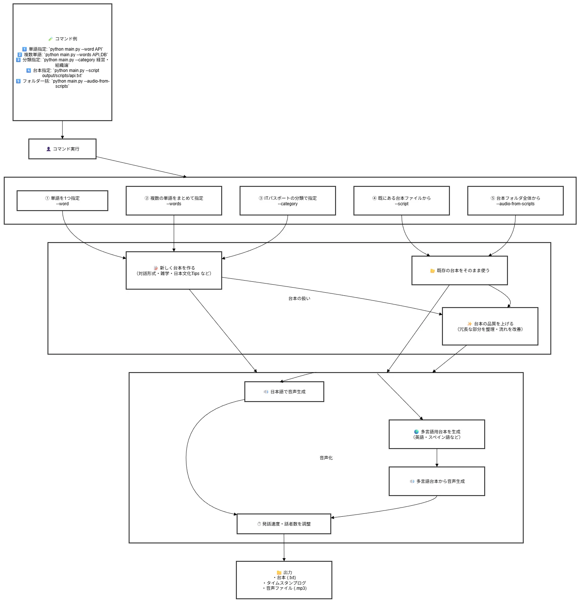
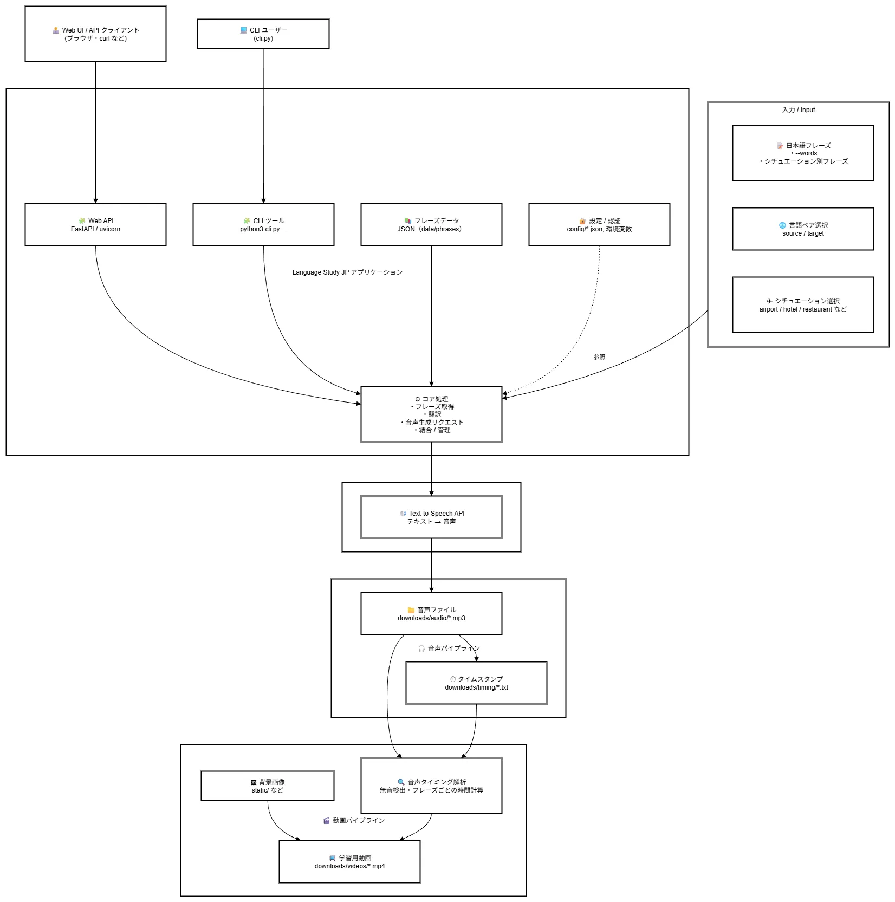
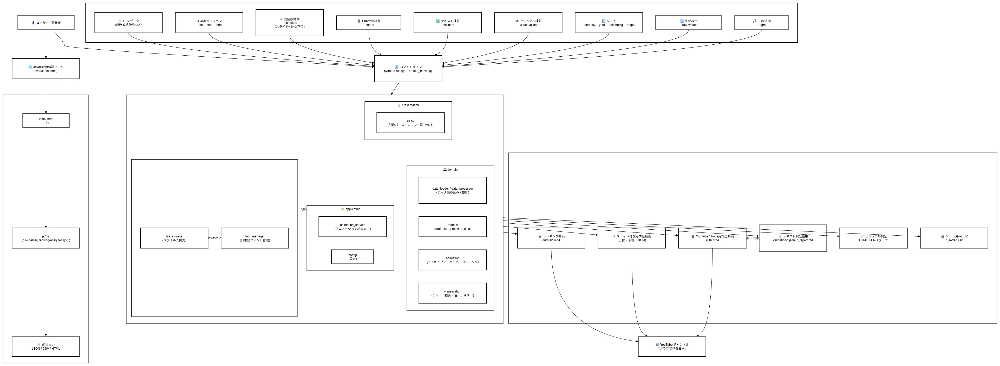

# Profile
ソフトウェアエンジニア / Web・AIアプリケーション開発

Laravel・Vue.js を中心に、Webアプリケーション開発から  
AI API を組み合わせた機能開発まで取り組んでいます。  
最近は音声生成・動画自動化・エージェント開発など、  
個人プロジェクトを通して技術領域を広げています。
スタートアップ〜小規模チームでの実務経験があり、チーム開発での
要件整理・設計・実装・レビューまで一通り担当。
エージェント/AI機能も実サービスに組み込みなど担当しています。

---

## 🛠 Skills

### Languages / Frameworks

  

### AI / Data

  

### Infra / DevOps

  

### Tools / Collaboration

  

### Editors

  

---

## 🧩 What I'm working on

### 🏢 企業実績 / Client Projects

- **企業向け CMS 開発**  
  Vue.js + Laravel による企業向けコンテンツ管理システム。  
  RESTful API 設計とフロントエンド開発を担当。

- **AI チャットボット導入プロジェクト**  
  Azure OpenAI API を利用したチャットボット機能を既存システムに統合。  
  社内問い合わせ対応の自動化を想定した業務フロー連携・運用設計を担当。

- **リアルタイム音声通話システム（PoC）**  
  OpenAI Realtime API を活用し、既存電話システムと連携する  
  リアルタイム音声通話の検証プロジェクト。  
  音声ストリーム処理と WebSocket 制御を担当。

### 🧪 個人開発 / Personal Projects

- **IT用語ポッドキャストメーカー（Python CLI）**  
  IT資格試験向け用語を AI で対話形式スクリプトに変換し、  
  Google Cloud TTS により日本語音声ポッドキャストを自動生成。  
  

- **多言語学習プラットフォーム**  
  Google Cloud TTSを使って8言語のシチュエーション別
  フレーズ音声・動画を生成する言語学習用FastAPIアプリケーション  
  

- **CSV → 動画生成ツール（自動化）**  
  CSV データを元に動画コンテンツを自動生成する Python スクリプト。  
  教材動画・説明動画の自動作成を目的に開発。  
  

- **ショート動画生成ツール**  
  YouTube Shorts、TikTok、Instagram Reels向けの縦型動画生成システム。
  9:16レイアウトでマルチプラットフォーム最適化を実現。

- **複数チャンネル一括アップロード**  
  8言語別YouTubeチャンネルへの自動アップロードシステム。
  マルチアカウント認証に対応。

- **X ポスト検索ツール**  
  Next.jsを使用した検索ツール。

- **Laravel / Next.js / NestJS を用いた Web アプリ開発**  
  認証・API・DB 設計など、フルスタック構成の個人プロジェクト。

- **Podcast / ZINE / 動画などの個人クリエイティブ活動**  
  技術 × 表現のアウトプットとして継続的に制作。

---

## 📫 Contact
- GitHub: https://github.com/yasu-programming
